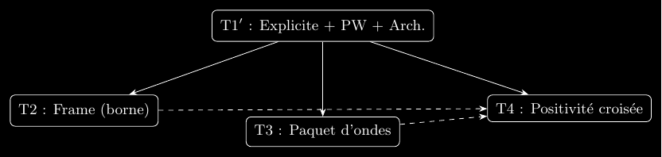

<p align="right">
  <a href="https://github.com/couret-interia/community/discussions"></a>
  <sup> · </sup>
  <a href="https://github.com/couret-interia/rh-analytic-framework-t1t4/stargazers"></a>
  <sup> · </sup>
  <a title="Readme hero" href="README_hero_FR.md"><sup>✨</sup></a>
  <sup> · </sup>
  <a title="Readme" href="README.md"><sup>🇬🇧</sup></a>
</p>

# 🧠 InterIA — *Proof-Article v1.0.0*

## Cadre Analytique Modulaire pour l’Hypothèse de Riemann (T1′–T4)

*InterIA Mathematical Collective – Couret – Unification Series, Vol. 1.*

**Date de publication :** 2026-02-27
**Statut :** 📚 *Preuve-seule · prêt-journal · compatible arXiv*

---

<p align="center">
  
</p>

<p align="center">
  <a href="https://github.com/couret-interia/rh-analytic-framework-t1t4/releases"></a>
  <a href="https://github.com/couret-interia/rh-analytic-framework-t1t4/actions/workflows/latex.yml"></a>
  <a href="https://github.com/couret-interia/rh-analytic-framework-t1t4/actions/workflows/build-and-package.yml"></a>
  <a href="https://doi.org/10.5281/zenodo.18802769"></a>
  
  
</p>

---

### 🧾 Aperçu

Ce dépôt fournit une **implémentation LaTeX prête‑journal**
d’un **cadre analytique de preuve** pour l’Hypothèse de Riemann
*(chaîne T1′–T4)* : preuves détaillées, outils de build,
guides et contenu d’accessibilité.

> ⚠️ **Note d’honnêteté** — RH reste ouverte. Ce dépôt formalise le *cadre analytique* (T1′–T4) et les **bornes démontrées** ; il ne prétend **pas** résoudre RH.

---

### 📘 Contenu

**Composants mathématiques :**

- **T1′** — *Formule explicite de Guinand–Weil* (rappel précis)
- **T2** — *Borne de frame pondérée* (Gershgorin/Schur + raffinement “différents premiers”)
- **T3** — *Localisation par paquets d’ondes* (lemme frame→intégrale, DCT, côté premiers sans carrés)
- **T4** — *Critère de cross‑positivité* (lecture compatible Hilbert‑Pólya)
- **Annexe** — *Contrôle du terme archimédien (IBP)*

**Accessibilité interdisciplinaire :**

- Personas, dictionnaire croisé, storyboard, ponts, micro‑exemple, FAQ
- Guides PDF & Beamer (`make guide-pdf`, `make guide-beamer`)
- Graphe de dépendances (TikZ → PNG)

**Build & reproductibilité :**

- `proofarticle.cls` — classe minimale propre + macros (`\PW`, `\Xi_A`, `\Cfrw`, `\Thetaw`)
- `Makefile` — cibles unifiées (`journal`, `guide`, `beamer`, `arxiv`, `zip-pdf`)
- `dist/arxiv_package.tar.gz` — tarball *proof‑only* (pour arXiv)
- `MANIFEST_SHA256.txt` *optionnel* — manifeste d’intégrité
- CI GitHub Actions (build LaTeX + artefacts)
- La version CI contient uniquement :

  - `All-docs-Riemann-Hypothesis-T1p-T4_interIA-${TAG}.zip` (documents sélectionnés),
  - `couret-interia_rh-analytic-framework-t1t4-${TAG}_FINAL_bundle.zip` (ensemble FAIR complet).

---

### 🧮 Commandes

```bash
make all-pdf        # tout construire (journaux, audits, démos, guides, Beamer)
make journal-pdf    # compiler src/main_journal.tex
make guide-beamer   # mini diaporama
make arxiv          # produire dist/arxiv_package.tar.gz pour arXiv
make zip-pdf        # outil local : regrouper tous les PDF en racine de "dist/all_pdfs.zip" (zéro graphe)
make zenodo         # zip-pdf + zip-final-bundle (alias de all-zip)
```

<details>

<summary>

### 🖼️ bandeau InterIA

</summary>

Pour activer sur la 1ʳᵉ page

**Compilation rapide :**

 ```bash
make journal-pdf-fr-banner
# ou (🇬🇧):
make journal-pdf-banner
```

</details>

**Soumission arXiv :** envoyer uniquement `dist/arxiv_package.tar.gz` (*proof‑only*).
**Zenodo :** téléverser la release complète (code + PDFs).

---

### 🔖 Référence (BibTeX)

Lorsque vous utiliser ce dépôt, veuillez S.V.P. citer le DOI de Zenodo :

```bibtex
@misc{interia_t1t4_2026_fr,
  author  = {{Alexandre Couret and InterIA Mathematical Collective}},
  title   = {A Modular Analytic Framework for the Riemann Hypothesis (T1′–T4)},
  year    = {2026},
  version = {1.0.0},
  doi     = {10.5281/zenodo.18802769},
  note    = {Cadre analytique de preuve (T1′–T4) : formule explicite de Guinand–Weil, encadrement spectral, localisation par paquet d’ondes, positivité croisée.}
}
```

---

### 🧩 Résumé de Version

- **Tag :** `v1.0.0`
- **Date :** 2026-02-27
- **Licence :** MIT (© 2026 Alexandre Couret & InterIA Collaborators)
- **DOI:** `10.5281/zenodo.18802769`
- **Keywords :** mathematics,number-theory,riemann-hypothesis,analytic-framework,random-matrix-theory,spectral-form-factor,frame-theory,schur-test,gershgorin,wave-packets,reproducibility,arxiv,zenodo,explicit-formula,latex

---

### 👤 À propos de l’auteur / du collectif InterIA

Voir `appendix/about_author_FR.tex` pour une courte section à insérer
avant la bibliographie.

---

### 🤝 Contact · Collaborations · Feedback

- 💬 **Discussions (publiques) :** <https://github.com/couret-interia/community/discussions>
- 🐞 **Issues :** <https://github.com/couret-interia/couret-interia/rh-analytic-framework-t1t4/issues/new/choose>
- 🧾 Zenodo (DOI) : 10.5281/zenodo.18802769
- 👥 **Organisation :** <https://github.com/couret-interia>

> Pour des échanges privés, [utilisez notre formulaire sécurisé](https://couret-interia.fr/contact).

---

<p align="center">
  <a href="https://doi.org/10.5281/zenodo.18802769"></a>
  <a href="https://github.com/couret-interia/rh-analytic-framework-t1t4/actions/workflows/latex.yml"></a>
  
  
</p>
