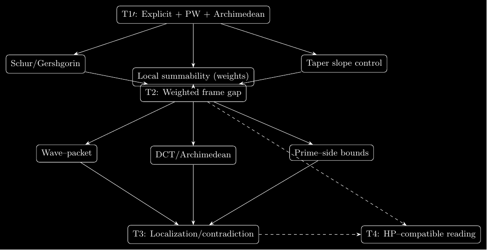

<p align="right">
  <a href="https://github.com/couret-interia/community/discussions"></a>
  <sup> · </sup>
  <a href="https://github.com/couret-interia/rh-analytic-framework-t1t4/stargazers"></a>
  <sup> · </sup>
  <a title="Readme hero" href="README_hero_FR.md"><sup>✨🇫🇷</sup></a>
  <sup> · </sup>
  <a title="Readme" href="README.md"><sup>🇬🇧</sup></a>
</p>

# 🧠 InterIA — *Proof-Article v1.0.0*

## **A Modular Analytic Framework for the Riemann Hypothesis (T1′–T4)**

**Release date:** 2026-02-27
**Status:** 📚 *Proof-only · journal-ready · arXiv-compatible*

---

<p align="center">
  
</p>

<h3 align="center"><em>“From analysis to clarity — proof of the framework, not of RH.”</em></h3>

---

> 🧮 **Status:** journal-ready · reproducible · proof-only framework
> *(non-resolutive; RH remains open)* \
> 🧾 **Maintained by:** [Alexandre Couret](https://github.com/alexcour)
> , [Thomas Ingles](https://github.com/sudwebdesign)
> & the **InterIA Mathematical Collective** \
> 🔗 **GitHub Organization:** [couret-interia](https://github.com/couret-interia) \
> 💬 **Discussions (public):** <https://github.com/couret-interia/community/discussions> \
> 📧 **For private exchanges:** [use our lightweight form to reach the maintainers](https://couret-interia.fr/contact)

---

### 🪶 About this release

This repository publishes the *analytic proof framework* (T1′–T4) developed by
the InterIA collective, turning Bernard Couret’s modular arithmetic intuition
into a modern, reproducible LaTeX environment.

**Key goals:**

- Preserve and document the mathematical legacy of the Couret family.
- Provide a transparent, reproducible analytic architecture for RH research.
- Offer open educational material (FR + EN) bridging mathematics, physics, and computation.

> “The Couret family worked to bring back to life the work of Papi Couret
  — which Papa Couret had kept on the corner of his desk.”

---

### 🔧 Analytic content (T1′–T4)

The project is organized around four analytic blocks:

- **T1′ — Explicit reformulation.**
  Guinand–Weil’s explicit formula recast in a frame-friendly, signal-style language.

- **T2 — Weighted frame bound.**
  Spectral bounds via Gershgorin/Schur, with a different-prime refinement.

- **T3 — Wave–packet localization.**
  Wave–packet construction adapted to the spectral/Archimedean structure,
  with explicit DCT and control of square terms.

- **T4 — Cross-positivity (framework).**
  A conceptual block coupling the frame bounds and
  localization into a cross-positivity scheme.
  *In this version, T4 is part of the global framework;
  fully detailed proofs are not included in the arXiv v1 proof-only tarball
  (which ships complete proofs for T2, T3, and the appendices).*

---

### 🧰 Reproducibility & CI

The repository is designed to be **reproducible**:

- Modular LaTeX (`proofarticle.cls`, `theorems/`, `appendix/`, `docs/`).
- GitHub CI to ensure the build passes (LaTeX compilation).
- Explicit scope statement: *proof framework* for RH, with no claim of resolution.

---

### 🔖 Citation (BibTeX)

If you use this repo, please cite the Zenodo DOI:

```bibtex
@misc{interia_t1t4_2026,
  author  = {{Alexandre Couret and InterIA Mathematical Collective}},
  title   = {A Modular Analytic Framework for the Riemann Hypothesis (T1′–T4)},
  year    = {2026},
  version = {1.0.0},
  doi     = {10.5281/zenodo.18802769},
  note    = {Proof-only analytic framework (T1′–T4): Guinand–Weil explicit, frame bound, wave-packet localization, cross-positivity.}
}
```

---

### 📚 Explore the *Proof Gallery*

The most up-to-date view of all PDFs
(journals, full proofs, λ audits, dependency maps)
lives on the GitHub Pages site:

[🖼️ Proof Gallery](https://couret-interia.github.io/rh-analytic-framework-t1t4/#gallery)

There you will find:

- slide-style overviews of T1′–T4 (FR/EN),
- proof journals for T2/T3,
- large-format dependency maps and explanatory diagrams.

---

### 🤝 Contact InterIA

- 💬 **Public discussions:** [https://github.com/couret-interia/community/discussions](https://github.com/couret-interia/community/discussions)
- 🧾 **About the collective:** see [`ABOUT_INTERIA.md`](./ABOUT_INTERIA.md) (FR/EN).

For collaboration, feedback or teaching requests,
please open a GitHub discussion or reach out through the **couret-interia** organization.

---

<p align="center">
  <a href="https://doi.org/10.5281/zenodo.18802769"></a>
  <a href="https://github.com/couret-interia/rh-analytic-framework-t1t4/actions/workflows/latex.yml"></a>
  
  
</p>
